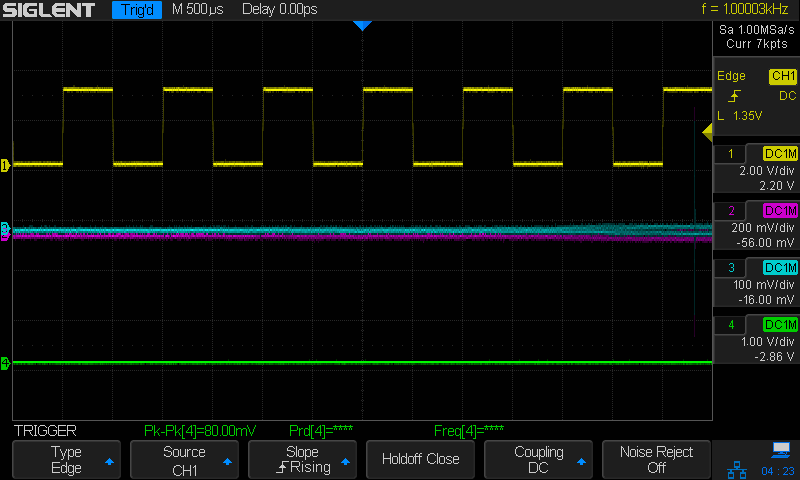

# `LXI_SIGLENT_CHECK`

The goal of `lxi_siglent_check` is to crowd source information of Siglent oscilloscopes about
the way they support remote control and acquisition SCPI commands.

(See the [Siglent Oscilloscope Programming Guide](https://siglentna.com/wp-content/uploads/dlm_uploads/2017/10/ProgrammingGuide_forSDS-1-1.pdf).)

This kind of information is really useful to make sure that tools such as
`glscopeclient` are compatible with a large amount of Siglent scopes out there.
Here's [a video](https://www.youtube.com/watch?v=LtLyrpRIE_0) that illustrates what 
glscopeclient allows you to do.

Some scopes have bugs, others don't. There might be subtle differences etc.

`lxi_siglent_check` checks for the presence of known bugs, queries capabilities, records a 
waveform, fetches a waveform etc.

Using it is easy:

* Install `liblxi`

    On Ubuntu: `sudo apt install liblxi-dev`

* Compile

    ```
    cd ./lxi_siglent_check
    ./run.sh
    ```

* Figure out the IP address of your Siglent scope

    * Plug in the Ethernet cable into the scope
    * Power cycle the scope
    * On the scope: 
        * Press `[Utility] -> [I/O] *(Page 2/3)* -> [LAN]`
        * Write down the IP address
        * Press `[Single]` to exit the menu

* Connect the probe of channel 1 to the calibration 1kHz output

* Configure the scope so that it triggers on channel 1 and so that it shows a nice square wave.

    Something like this:

    

* Run the tool

    `./lxi_siglent_check <IP address of the scope> | tee siglent_results.log`

    When running the tool, a number of settings of the scope will be changed: vdiv, timebase, probe attenuation, 
    number of sample points, ... Nothing major though.

* Email the log to `hombre at gmail dot com`

